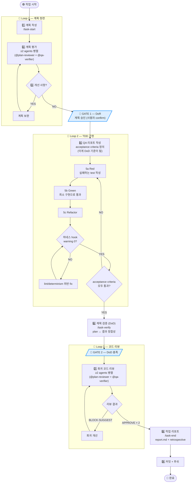

# CritterGym Task Lifecycle Process

> 단계 어휘 (L1·G1·L2·G2·L3) 매핑: [.claude/rules/80-task-lifecycle.md](../../../.claude/rules/80-task-lifecycle.md#단계-어휘-stage-vocabulary-ssot)
> 작성일: 2026-04-25 | 버전: v1
> 목적: AI 하네스(.claude/) 와 결합한 표준 작업 프로세스 정의. Task 라이프사이클의 청사진. CritterGym RL 환경 코드베이스에 종속되지 않는 도메인 무관 layer.

---

## 개요

본 프로세스는 RFC + ATDD + Multi-Reviewer PR 의 합성으로, **계획 → 정련 → 승인 → TDD 구현 → 검증 → 리뷰 → 리포트 → 커밋** 의 결정적 단방향 흐름에 3개의 정련 loop 와 2개의 게이트를 가진다.

**대응 표준**:
- **RFC-driven**: 계획 평가 loop = Google Design Doc / Amazon Working Backwards
- **ATDD**: QA criteria 를 구현 앞에 정의 = Acceptance Test Driven Development
- **TDD**: Red → Green → Refactor (XP)
- **Multi-Reviewer PR**: 2+ agent 합의 = high-stakes/regulated 환경 표준
- **DoR / DoD Gates**: Scrum 의 Definition of Ready / Done

---

## 다이어그램



---

## ASCII 다이어그램 (터미널·non-mermaid 환경)

```
                    🟢 작업 시작
                         │
                         ▼
              ┌──────────────────────┐
              │  1. 계획 작성        │
              │     /task-start      │
              └──────────┬───────────┘
                         │
            ┌────────────▼─────────────┐
            │  🔁 Loop 1 — 계획 정련    │
            │  ┌────────────────────┐  │
            │  │ 2. 계획 평가       │  │
            │  │   ≥2 agents 병렬   │  │
            │  └─────────┬──────────┘  │
            │            ▼             │
            │  ┌────────────────────┐  │
            │  │ 3. 개선 필요?       │  │
            │  └──┬───────┬─────────┘  │
            │ YES│       │NO           │
            │    └──↺────┘             │
            └────────────┬─────────────┘
                         │
              ╔══════════▼═══════════╗
              ║ 🚪 GATE 1 — DoR       ║
              ║ 계획 승인 (사용자)    ║
              ╚══════════┬═══════════╝
                         ▼
              ┌──────────────────────┐
              │ 4. QA 리포트 작성    │
              │   acceptance criteria │
              └──────────┬───────────┘
                         │
            ┌────────────▼─────────────┐
            │ 🔁 Loop 2 — TDD 구현      │
            │   ┌──────────────────┐   │
            │   │ 5a Red (test↑)   │◄──┼──┐
            │   └────────┬─────────┘   │  │
            │            ▼             │  │
            │   ┌──────────────────┐   │  │
            │   │ 5b Green (impl)  │   │  │
            │   └────────┬─────────┘   │  │
            │            ▼             │  │
            │   ┌──────────────────┐   │  │
            │   │ 5c Refactor      │   │  │
            │   └────────┬─────────┘   │  │
            │            ▼             │  │
            │   ┌──────────────────┐   │  │
            │   │ Hook warning 0?  │   │  │
            │   │ NO → fix → ↺     │   │  │
            │   │ YES ↓            │   │  │
            │   └────────┬─────────┘   │  │
            │            ▼             │  │
            │   ┌──────────────────┐   │  │
            │   │ acceptance pass? │   │  │
            │   │ NO ─────────────┐│   │  │
            │   │ YES ↓           ││   │  │
            │   └────────┬────────┘│   │  │
            │            │         └───┼──┘
            └────────────┼─────────────┘
                         ▼
              ┌──────────────────────┐
              │ 6. 계획 검증 (DoD)   │
              │    /task-verify       │
              └──────────┬───────────┘
                         │
              ╔══════════▼═══════════╗
              ║ 🚪 GATE 2 — DoD 충족  ║
              ╚══════════┬═══════════╝
                         ▼
            ┌────────────────────────┐
            │ 🔁 Loop 3 — 코드 리뷰   │
            │   ┌──────────────────┐ │
            │   │ 7. 회귀 리뷰     │◄┼──┐
            │   │   ≥2 agents 병렬 │ │  │
            │   └────────┬─────────┘ │  │
            │            ▼           │  │
            │   ┌──────────────────┐ │  │
            │   │ BLOCK or SUGGEST │ │  │
            │   │ → 회귀 개선 ↺    │─┼──┘
            │   │ APPROVE × 2 ↓    │ │
            │   └────────┬─────────┘ │
            └────────────┼───────────┘
                         ▼
              ┌──────────────────────┐
              │ 8. 작업 리포트       │
              │   /task-end          │
              └──────────┬───────────┘
                         ▼
              ┌──────────────────────┐
              │ 9. 커밋 + 푸쉬       │
              └──────────┬───────────┘
                         ▼
                    🔵 완료
```

---

## Loop 명세

| Loop | 위치 | 종료 조건 | 책임 에이전트 / 도구 | 최대 반복 |
|---|---|---|---|---|
| **L1 — 계획 정련** | 계획 작성 직후 | 모든 agent 가 "개선 사항 없음" | `@plan-reviewer` + `@qa-verifier` (병렬) | 무제한 (사용자 컷오프) |
| **L2-inner — TDD micro** | 구현 단계 내부 | hook warning 0 + 1 acceptance 통과 | `tdd-guard` + lint/determinism hook | 사이클당 ≤ 3 fix |
| **L2-outer — TDD macro** | 구현 단계 전체 | 모든 acceptance criteria pass | `/task-loop` (자율) | 5회 (no-progress 감지 시 조기 종료) |
| **L3 — 코드 리뷰** | DoD 통과 후 | 2+ agent 가 모두 `APPROVE` | `@plan-reviewer` + `@qa-verifier` (병렬) | 사용자 컷오프 |

---

## Gate 명세 (단방향, 되돌릴 수 없음)

| Gate | 위치 | 통과 조건 | 통과 후 산출물 |
|---|---|---|---|
| **G1 DoR** | Loop 1 종료 직후 | L1 통과 + 사용자 승인 | `plan.md` 확정 + acceptance criteria 초안 |
| **G2 DoD** | 계획 검증 직후 | L2 종료 + `/task-verify` PASS | 구현 코드 + test + `qa-checklist.md` |

게이트 통과 후에는 이전 단계로 자동 회귀 안 됨 (수동 `/task-start` 재진입만 가능).

---

## 단계별 산출물

| Step | 산출물 | 위치 |
|---|---|---|
| 1 계획 | `plan.md` | `docs/_active/[<initiative>/]<slug>/plan.md` |
| 4 QA criteria | `qa-checklist.md` 초안 | `docs/_active/[<initiative>/]<slug>/qa-checklist.md` |
| 5 TDD | test 파일 + 구현 + 커밋 | 작업 브랜치 |
| 6 DoD verify | verify report | iteration log (메모리) |
| 7 리뷰 | review comments + 개선 commits | PR thread |
| 8 작업 리포트 | `report.md` | `docs/_active/[<initiative>/]<slug>/report.md (u2192 uc644ub8cc uc2dc archive)` |
| 9 커밋 | git commits + push | origin |

---

## 하네스 매핑 (기반 → 라이프사이클)

| Step | 기반 자산 | 라이프사이클 신규 |
|---|---|---|
| 1 계획 | `commands/task-start.md` | → `skills/task-start/SKILL.md` (Skill 변환) |
| 2 평가 | — | `agents/plan-reviewer.md` 신규 + `@<domain>-auditor` (추가 시) 활용 |
| 3-4 QA criteria | — | `context/lifecycle/pass-criteria.md` 템플릿 |
| 5 TDD | `tdd-guard/`, hooks | `skills/task-loop/SKILL.md` (자율 루프) |
| 6 DoD | — | `skills/task-verify/SKILL.md` |
| 7 리뷰 | — | `agents/plan-reviewer.md` + `agents/qa-verifier.md` 신규 |
| 8 리포트 | `commands/task-end.md` | → `skills/task-end/SKILL.md` (Skill 변환) |
| 9 커밋 | — | (수동 또는 별도 hook) |

---

## 표준 프로세스와의 대응

| 본 프로세스 단계 | 표준 SDLC 명칭 |
|---|---|
| L1 계획 정련 | RFC / Design Doc Review |
| G1 DoR | Definition of Ready |
| 4 QA 리포트 | ATDD Acceptance Criteria |
| L2 TDD | XP Test-Driven Development cycle |
| 6 계획 검증 | Acceptance Testing |
| G2 DoD | Definition of Done |
| L3 코드 리뷰 | PR Code Review (peer review × N) |
| 8 작업 리포트 | Sprint Retrospective / Story Closure |
| 9 커밋 푸쉬 | Merge / Deploy |

---

## 운용 원칙

1. **단방향 전진**: 게이트 통과 후 회귀 금지. 문제 발견 시 `/task-start` 재진입
2. **병렬 평가**: L1·L3 의 multi-agent 검토는 반드시 **병렬** (순차는 confirmation bias 위험). **예외 — quick-fix mode**: single reviewer (rules/80 §A.2 예외, §F.1)
3. **acceptance criteria 사전 정의**: G1 통과 시점에 acceptance 가 확정 — 구현 도중 추가 금지 (scope creep 방지)
4. **자율 루프 컷오프**: L2-outer / L3 는 `max_iterations=5`. 도달 시 사용자 에스컬레이션. **heavy mode**: cap 8 격상
5. **하네스 strict 전환 후 (Phase 6)**: L2-inner 의 hook warning 은 차단으로 격상
6. **Mode tiering** (rules/80 §F, 2026-05-01): 작업 영향도 (file 수 + criticality) 자동 분류 — quick-fix / standard / heavy. CHANGELOG entry mode 무관 강제 (audit floor)

### Mode 별 lifecycle 차이

```
🟢 quick-fix (1-3 file + criticality=low)
  task-start (minimal plan) → [task-evaluate single qa-verifier] → G1 → 구현 →
  [task-verify skip 가능] → G2 → [task-review single qa-verifier] → task-end (minimal)

🟡 standard (default — mode 부재 또는 위/아래 외)
  task-start → task-evaluate (≥2 agent) → G1 → 구현 →
  task-loop (max 5 iter) → task-verify → G2 → task-review (≥2 reviewer) → task-end

🔴 heavy (50+ file 또는 domains 3+)
  task-start → task-evaluate (paths routing 의무, 모든 vertical) → G1 → 구현 →
  task-loop (max 8 iter) → task-verify → G2 → task-review (모든 vertical reviewer) → task-end
```

---

## 변경 이력

| 일자 | 버전 | 변경 |
|---|---|---|
| 2026-04-25 | v1 | 초안 작성. Phase 3 완료 직후 Phase 4 청사진 |
| 2026-05-01 | v1.1 | Mode tiering 추가 (rules/80 §F) — 운용 원칙 #2/#4 mode 분기 + Mode 별 lifecycle 시각화 |
