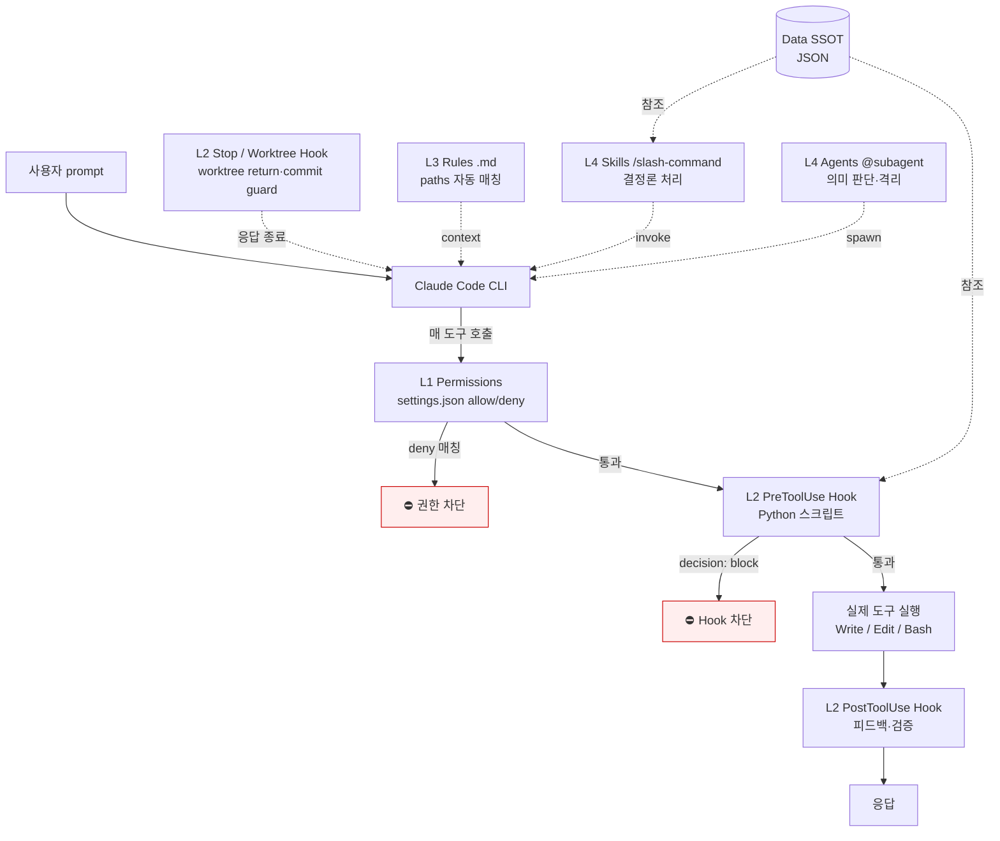

# CritterGym Harness — 코작업자 온보딩

> CritterGym — 절차적으로 생성되는 creature-collection 강화학습(RL) 환경 (Python, Gymnasium API, JAX target) for RL researchers.
> AI (Claude Code) 가 CritterGym 코드베이스의 Task Lifecycle 규칙 안에서 작업하도록 강제하는 **4 레이어 결정론 시스템**. 사람이 매번 코드리뷰로 막던 일을 hook + rules + skills + agents 4단으로 미리 차단/가이드한다.

---

## TL;DR — 3줄 요약

1. **AI 가 deny 또는 ⛔ 메시지를 받으면** = 사용자(=리드/팀원) 승인 필요한 상황. 차단 메시지에 우회 절차가 명시되어 있으니 그대로 따른다.
2. **큰 작업은 `/task-start` 부터**. main 에서 직접 작업 금지 — feature/fix 브랜치에서 lifecycle 흐름을 탄다.
3. **결정론 검증은 hook, 의미 판단은 agent**. lint/determinism 같은 regex/AST 검사는 hook 이, plan 품질 같은 의미 판단은 `@plan-reviewer`/`@qa-verifier` 가 맡는다.

이 셋만 지키면 80% 통과. 나머지는 차단 메시지 보고 절차 따라가면 됨.

---

## 시스템 레이어 다이어그램



---

## 4 레이어 상세 — 제약점 + 확인점

### L1. Permissions (`.claude/settings.json`)

| 항목 | 값 |
|---|---|
| 위치 | `.claude/settings.json` (팀 공유, commit), `.claude/settings.local.json` (개인, gitignore) |
| 적용 시점 | **매 도구 호출 직전** — 도구 실행 전 매칭 검사 |
| 핵심 패턴 | `Edit(src/critter_gym/**)`, `Write(...)`, `Bash(pytest:*)` |
| 우선순위 | **deny > allow** (deny 가 먼저 차단) |
| **반영 시점** | ⚠️ **세션 재시작 필요** — Claude Code 가 settings hot-reload 안 함 |

**확인점:**
- 새 명령/파일 영역 작업 거부되면 → settings.json 의 allow 에 패턴 추가 + 세션 재시작
- 보호 영역은 deny 명시

---

### L2. Hooks (`.claude/hooks/*.py`)

Python subprocess. **매 호출마다 새로 spawn** → 코드 변경이 즉시 반영 (재시작 불필요).

| 시점 | 매처 | Hook | 역할 |
|---|---|---|---|
| **PreToolUse** | Bash | `git-policy-guard.py` | git 머지/푸시 정책 (단방향 sink, forbidden prefix) 차단 |
| | (task 의도) | `harness-task-start-guard.py` | lifecycle 우회 차단 (큰 변경에 plan 없이 진입 방지) |
| | (commit) | `harness-commit-guard.py` | 정책 위반 commit 차단 |
| | (worktree) | `agent-worktree-stop-guard.py` | agent worktree 누수 방지 |
| **PostToolUse** | (task 의도) | `harness-task-intent-nudge.py` | 큰 변경에 lifecycle 진입 권유 |
| | (commit) | `harness-commit-intent-record.py` | commit 의도 기록 |
| | (archive) | `task-end-archive-guard.py` | `/task-end` active→archive 이동 검증 |
| **Stop / 반환** | (응답 종료) | `agent-worktree-return-handler.py` | agent worktree 정리·반환 |

**제약점:**
- Hook 은 stdin JSON 받고 `decision: "block"` 출력하면 차단. exit 2 도 차단 (호환).
- Hook command 는 `python3 "$CLAUDE_PROJECT_DIR/.claude/hooks/X.py"` 절대 경로 — 셸 CWD 무관.

**확인점:**
- 차단되면 출력 메시지가 `⛔` 로 시작. **메시지에 우회 절차 명시되어 있음** — 그대로 따르면 됨.

---

### L3. Rules (`.claude/rules/*.md`)

자동 로드 룰. paths 매칭 시 **메인 에이전트 컨텍스트에 첨부** — 서브에이전트엔 전파 안 됨 (서브에이전트는 자체 본문에 핵심 임베드).

| 파일 | 우선순위 | 적용 |
|---|---|---|
| `80-task-lifecycle.md` | 80 | 무조건 로드 — 9단계 + 3 loop + 2 gate, iteration cap |
| `85-git-policy.md` | 85 | git 작업 시 — 단방향 sink + prefix 정책 |
| `_ownership.md` | (메타) | 책임자 맵 + 변경 이력 |

**제약점:**
- 우선순위 **낮은 숫자가 강함**
- 새 룰 추가 시 frontmatter 필수 5필드: `id, version, paths, priority, owner`

**확인점:**
- 룰 충돌 시 `_ownership.md` 의 책임자에게 결정 위임
- 데이터 의존 규칙은 `data/*.json` SSOT 참조만 — **값 복붙 금지**

---

### L4. Skills + Agents

| 종류 | 위치 | 호출 | 비용 | 용도 |
|---|---|---|---|---|
| **Skills** | `.claude/skills/*/SKILL.md` | `/<name>` (slash command) | 대부분 LLM 미호출 (Bash + Python) | 결정론 작업 — `/task-start`, `/task-evaluate`, `/task-verify`, `/task-loop`, `/task-review`, `/task-end` |
| **Agents** | `.claude/agents/*.md` | `@<name>` 또는 자동 | LLM 호출 (격리 컨텍스트) | 의미 판단 — `@plan-reviewer` (Sonnet), `@qa-verifier` (Haiku 저렴) |

vertical 전용 auditor (`@<domain>-auditor`) 를 추가하면 `/task-evaluate` 의 paths 라우팅이 자동으로 포함한다 (확장 지점). 기본은 plan-reviewer + qa-verifier.

**제약점 (`80-task-lifecycle.md` § C):**
- regex/AST/glob 검증은 **무조건 hook** (agent 사용 BLOCK)
- on-demand 결정론은 **skill 우선**, agent 는 의미 판단 필요한 경우만
- agent 출력은 `APPROVE / SUGGEST: <축>: <한줄> / BLOCK: <축>: <한줄>` 형식만 (자유 본문 금지)

---

## 데이터 SSOT (`.claude/data/`)

Hook 과 Skill 이 참조하는 단일 진실 출처. **AI 가 자의로 변경 못 하도록 deny 또는 hook 보호.**

| 파일 | 보호 | 용도 |
|---|---|---|
| `git-branch-prefixes.json` | (참조) | source/sink/trunk/special/forbidden prefix 화이트리스트 |
| `schemas/**` | **deny** | JSON 스키마 정의 |

---

## env 설정 — 코작업자 첫날 필수

### Claude Code 하네스 환경변수

| 변수 | 위치 | 값 | 효과 |
|---|---|---|---|
| `HARNESS_GIT_POLICY_OVERRIDE` | shell export | `0` (기본) / `1` | git 정책 hook 우회 (긴급/정책 갱신 시) |
| `HARNESS_SKIP_HARNESS` | shell export | `0` (기본) / `1` | lifecycle 진입 가드 우회 |
| `HARNESS_ALLOW_COMMIT` | shell export | `0` (기본) / `1` | commit guard 우회 |
| `HARNESS_ARCHIVE_GUARD_OVERRIDE` | shell export | `0` (기본) / `1` | task-end archive 가드 우회 |
| `HARNESS_ALLOW_AGENT_WT_LEAK` | shell export | `0` (기본) / `1` | agent worktree 누수 가드 우회 |
| `HARNESS_WT_AUTO_DISCARD_DISABLE` | shell export | `0` (기본) / `1` | 변경 없는 worktree 자동 폐기 비활성 |
| `CLAUDE_PROJECT_DIR` | (Claude Code 자동 주입) | 절대 경로 | hook subprocess 가 프로젝트 루트 인식 |
| `PYTHONIOENCODING` | settings.json env | `utf-8` | 인코딩 일관성 |

### 첫날 체크리스트

```bash
# 1. 의존성 (Python, 가상환경 권장)
python -m venv .venv && source .venv/bin/activate
pip install -e ".[dev]"

# 2. 테스트·린트 동작 확인
pytest
ruff check src tests

# 3. Claude Code 시작 (프로젝트 루트에서)
claude
```

### 코작업자가 자주 헷갈리는 것

| 상황 | 정답 |
|---|---|
| "큰 변경 바로 해도 됨?" | 아니오. `/task-start` 부터. feature/fix 브랜치에서 시작 (main 에서 작업 금지) |
| "Bash 에서 cd 해도 됨?" | 서브셸 OK (`(cd dir && cmd)`). 그냥 `cd dir && cmd` 는 셸 CWD 누출되지만 hook 은 `$CLAUDE_PROJECT_DIR` 로 보호됨 |
| "hook 변경했는데 적용?" | 즉시 적용 (subprocess 매번 spawn). settings.json 만 세션 재시작 필요 |
| "git 머지가 차단됨" | 단방향 sink 정책 위반 가능. `git-branching-model.md` 참조, 정당하면 `HARNESS_GIT_POLICY_OVERRIDE=1` |

---

## 자주 만나는 차단 메시지 + 절차

### "⛔ git 정책 위반 (sink 역머지 / forbidden prefix)"
→ `git-branching-model.md` 의 단방향 sink 정책 확인. 정당한 우회면 `HARNESS_GIT_POLICY_OVERRIDE=1` 토글 후 재시도.

### "⛔ 큰 변경인데 plan 이 없습니다"
→ N≥5 파일 변경에 lifecycle 미진입. `/task-start "<제목>"` 으로 plan.md 생성 후 진행. 우회는 `HARNESS_SKIP_HARNESS=1`.

### "⛔ commit 차단"
→ harness-commit-guard 가 정책 위반 감지. 정당하면 `HARNESS_ALLOW_COMMIT=1`.

### "동일 fail 2회 연속"
→ no-progress 감지. 사용자 에스컬레이션 시점. AI 와의 대화 흐름을 끊고 plan 재정의 권장 (`80-task-lifecycle.md` § A.5).

---

## Task Lifecycle — 큰 작업의 표준 흐름

본 하네스에는 9단계 작업 lifecycle 이 통합되어 있음. 큰 작업 시 권장:

```
1. /task-start "<제목>"        — plan.md 생성 (frontmatter domains + scope_paths)
2. /task-evaluate              — L1 평가 (≥2 agent 병렬, paths 라우팅)
3. (G1 DoR)                    — qa-checklist 자동 합산, acceptance freeze
4. TDD 구현                    — /task-loop 자율 max 5
5. /task-verify                — L2 inner check (G2 DoD 자동 판정)
6. /task-review                — L3 multi-reviewer 합의
7. /task-end                   — report.md + qa-checklist.md
8. 사용자 검토 + 커밋 + 푸쉬
```

세부: [process-diagram.md](../explanation/process-diagram.md), [task-lifecycle.md](../explanation/task-lifecycle.md)

---

## 관련 문서 링크 맵

| 문서 | 용도 |
|---|---|
| [process-diagram.md](../explanation/process-diagram.md) | 9단계 + 3 loop + 2 gate 다이어그램 |
| [task-lifecycle.md](../explanation/task-lifecycle.md) | lifecycle 통합 계획 + 운용 원칙 |
| [git-branching-model.md](../explanation/git-branching-model.md) | trunk-based + 단방향 sink 옵션 |
| [verdict-equivalence.md](./verdict-equivalence.md) | reviewer 프롬프트 동등성 게이지 |
| [measure-token-usage.md](./measure-token-usage.md) | 토큰 usage 실측 |
| [.claude/rules/_ownership.md](../../../.claude/rules/_ownership.md) | 룰 책임자 맵 + 변경 절차 |

---

## 변경 이력

| 일자 | 버전 | 변경 |
|---|---|---|
| 2026-04-27 | 1.0.0 | 초안. 4 레이어 다이어그램 + 코작업자 onboarding 체크리스트 + env 매트릭스 + 자주 만나는 차단 메시지 |
</content>
